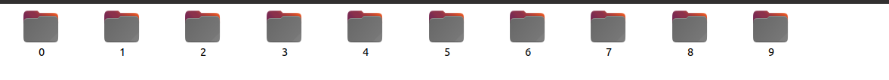

# image_classification
The primary goal of this project is to show, how to create efficient datasets using tf.data.Dataset and tfrecord 
and how to use it to train a basic image classifier.

## Setting the env and running the code
1. clone the repo then do the following
```commandline
cd image_classification && mkdir data && cd data && \
 mkdir mnist && cd mnist && mkdir images && \
 cd images && mkdir train && mkdir test
```
2. Copy train data in train directory with labels as folder name and corresponding images
in each folder as shown below.

3. Copy test images in test folder and then do the following
4. Do the following
```commandline
conda env create -f image_classification.yml
conda activate image_classification
conda activate image_classification
```
5. export path
```commandline
export PYTHONPATH=/path/to/image_classification/src/py
```
6. to run do the following
```commandline
python /path/to/execute.py
```

## Run using docker
1. pull  and run the docker image
```commandline
docker pull vikey725/image_classifier:latest
docker run -it vikey725/image_classifier:latest bash
export PYTHONPATH=/app/image_classification/src/py
python image_classification/src/py/image_classification/execute.py
```


